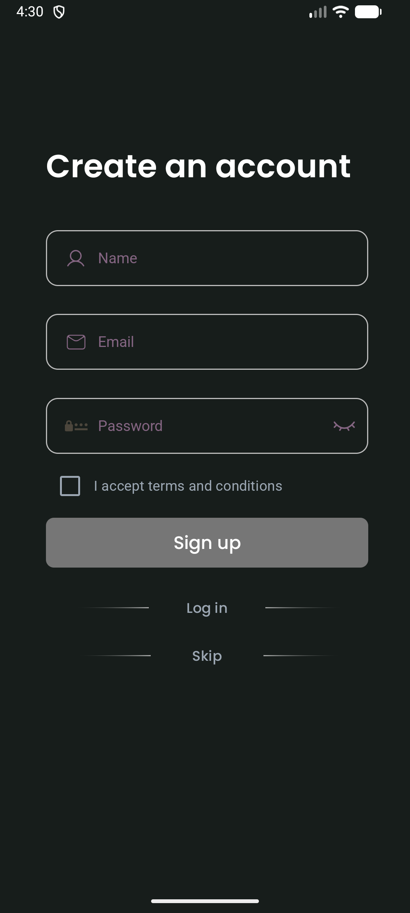
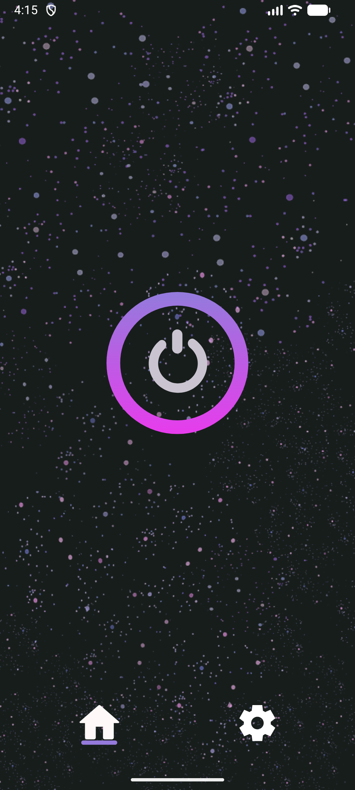
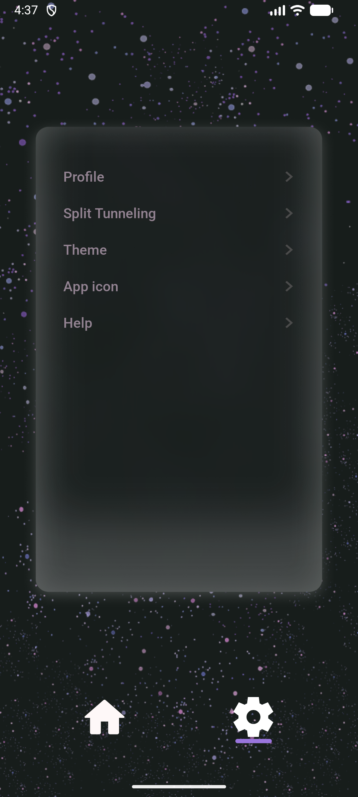

# AstralVPN

**AstralVPN** is a modern Android VPN client. It aims to provide secure, private internet access with fast connection speeds and an intuitive user interface.

## ⚠️ Important Note

This project is currently in active development. Core features are being implemented and it is not yet ready for production use.

## Planned Features

* One-tap server connection
* Traffic encryption
* No registration required
* Light/Dark theme support
* English and Russian localization
* No-logs policy

## Screenshots

<table>
  <tr>
    <td></td>
    <td></td>
    <td></td>
    <td></td>    
  </tr>
  <tr>
    <td colspan="2" align="center">Dark Theme</td>
  </tr>
</table>

## Tech stach
* Language: **Kotlin**
* Architecture: **MVVM**
* UI: **Jetpack Compose**
* Libraries: Retrofit, Hilt, Room, Coroutines, Flow, Firebase
